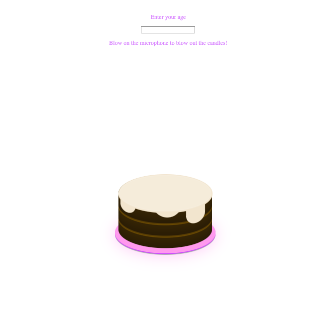
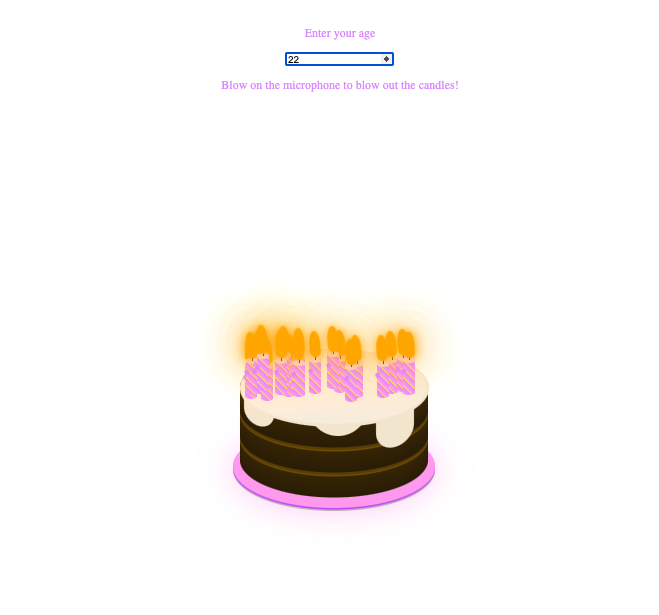
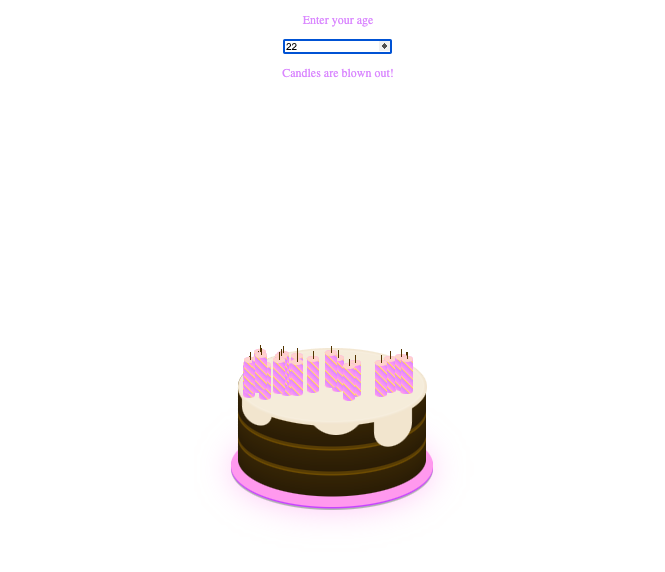

# Birdhday Cake

This interactive virtual candle responds to microphone blowing, featuring an animation of a gradual disappearance upon blow activation.

## Table of contents

- [Overview](#overview)
  - [The challenge](#the-challenge)
  - [Screenshot](#screenshot)
  - [Links](#links)
- [My process](#my-process)
  - [Built with](#built-with)
  - [What I learned](#what-i-learned)
  - [Continued development](#continued-development)
  - [Useful resources](#useful-resources)


## Overview

### The challenge

Users should be able to: 
- interact with candles on the screen
- private action involves blowing into the microphone to simulate blowing out candles

### Screenshot





### Links

- Live Site URL: https://sue-bd-cake.netlify.app/

## My process

### Built with

- Semantic HTML5 markup
- CSS custom properties
- [React](https://reactjs.org/) - JS library

### What I learned

- Implementing a readable and responsible microphone intergatin to detect blowing accurately

```js
const initializeMicrophone = async () => {
  try {
    const stream = await navigator.mediaDevices.getUserMedia({
      audio: true,
    });
    audioContext = new (window.AudioContext || window.webkitAudioContext)();
    analyser = audioContext.createAnalyser();
    microphone = audioContext.createMediaStreamSource(stream);

    microphone.connect(analyser);

    analyser.fftSize = 256;
    const bufferLength = analyser.frequencyBinCount;
    const dataArray = new Uint8Array(bufferLength);

    const detectBlow = () => {
      analyser.getByteFrequencyData(dataArray);

      const average =
        dataArray.reduce((acc, val) => acc + val, 0) / bufferLength;

      if (average > 100 && !blowDetected) {
        handleBlow();
      }

      requestAnimationFrame(detectBlow);
    };

    detectBlow();
  } catch (error) {
    console.error("Error accessing microphone:", error);
  }
};
```

- Ensuring the animation synhronized smoothly with the detected blowing.

```css
.flicker {
  animation: flicker 1s ease-in-out alternate infinite;
}

@keyframes flicker {
  0% {
    transform: skewX(5deg);
    box-shadow: 0 0 10px rgba(orange, 0.2), 0 0 20px rgba(orange, 0.2),
      0 0 60px rgba(orange, 0.2), 0 0 80px rgba(orange, 0.2);
  }
  25% {
    transform: skewX(-5deg);
    box-shadow: 0 0 10px rgba(orange, 0.5), 0 0 20px rgba(orange, 0.5),
      0 0 60px rgba(orange, 0.5), 0 0 80px rgba(orange, 0.5);
  }
  50% {
    transform: skewX(10deg);
    box-shadow: 0 0 10px rgba(orange, 0.3), 0 0 20px rgba(orange, 0.3),
      0 0 60px rgba(orange, 0.3), 0 0 80px rgba(orange, 0.3);
  }
  75% {
    transform: skewX(-10deg);
    box-shadow: 0 0 10px rgba(orange, 0.4), 0 0 20px rgba(orange, 0.4),
      0 0 60px rgba(orange, 0.4), 0 0 80px rgba(orange, 0.4);
  }
  100% {
    transform: skewX(5deg);
    box-shadow: 0 0 10px rgba(orange, 0.5), 0 0 20px rgba(orange, 0.5),
      0 0 60px rgba(orange, 0.5), 0 0 80px rgba(orange, 0.5);
  }
}

.fadeOut {
  animation: fadeOut 1s ease-in-out forwards;
}
@keyframes fadeOut {
  to {
    opacity: 0;
  }
}
```

- Optimizing performance, when dealing with continious mocrophone input and animation.

```js
const detectBlow = () => {
  analyser.getByteFrequencyData(dataArray);

  const average = dataArray.reduce((acc, val) => acc + val, 0) / bufferLength;

  if (average > 100 && !blowDetected) {
    handleBlow();
  }

  requestAnimationFrame(detectBlow);
};
```

### Continued development

Fixing problems with blow detection on Android.

### Useful resources

- [CSS portal](https://www.cssportal.com/css-to-scss/) - This helped me to fix problems with SCSS styling.
